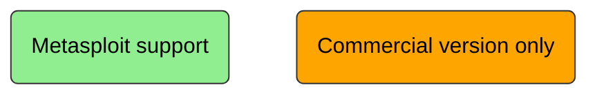

# Metasploit

Metasploit is a exploitation framework (aka penetration framework) , build for security professional to support penetration testing.

**Most related alternative**  
Cobalt strike – closed source/ commercial use only

## Why prefer Metasploit?  
It supports and provides sufficient tools for almost all the phases of the penetration testing.

**Notations**

**Phases of penetration testing**

## Modules provided by Metasploit?

 - exploits – the code that if executed takes advantage of the vulnerability to get unauthorized access to the desired system. Usually by the payload.

- payload – used by exploits. payload is a piece of code that are run by the target after successful exploitation (for backdoor, add new user, privilege escalation)

- Auxiliary – pre-exploitation features (scanning, fuzzing, sniffing)

- Encoders – to bypass firewall, IDS, IPS, Antivirus

- NOPS – no operation, use to ensure that if using multiple payloads, it is of same size. It ensures the proper execution of the instructions.

## How to Get Started?
