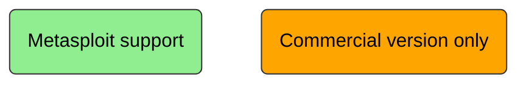
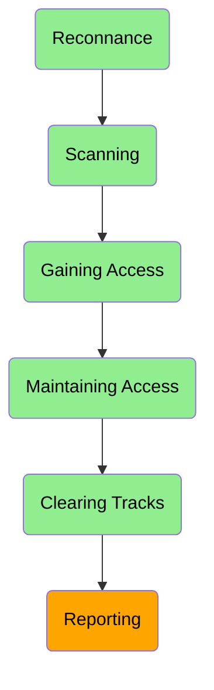

# Metasploit

Metasploit is a exploitation framework (aka penetration framework) , build for security professional to support penetration testing.

**Most related alternative** <br>
Cobalt strike – closed source/ commercial use only

## Why prefer Metasploit? <br>
It supports and provides sufficient tools for almost all the phases of the penetration testing.

**Notations**

**Phases of penetration testing**

style F fill:orange,stroke:#333,stroke-width:1px
```
