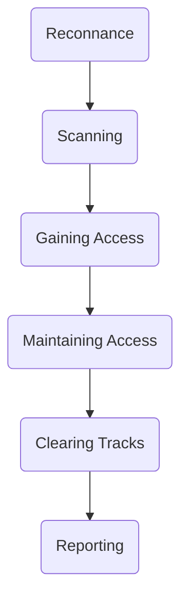

# Metasploit

Metasploit is a exploitation framework (aka penetration framework) , build for security professional to support penetration testing.

**Most related alternative**
Cobalt strike – closed source/ commercial use only

## Why prefer Metasploit??
It supports and provides sufficient tools for almost all the phases of the penetration testing.

**Phases of Penetration Testing:**
Metasploit support - green  
Commercial version only - yellow

Inline-style: 

